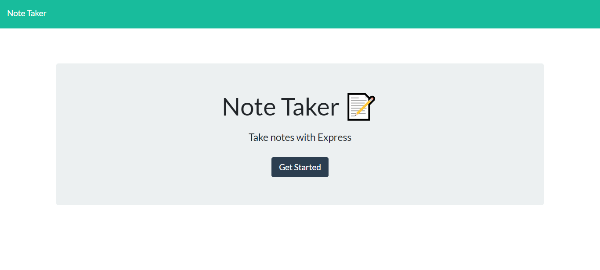

# Express-Homework-Note-Taker

# Unit 11 Express - Note Taker

## Summary

My 11th coding camp homework assignment was creating and deploying the backend of a note taker application using express. Creation was successfully completed using a local server, and constructing corresponding API routes made to parse and store user information. I employed node.js, installing several core dependencies including express, inquirer, and path. All of these moving parts come together to create a seamless creation and deletion of user input.

## Instructions

To successfully run this application, the user should first clone the repository into a local file and run npm install. Using the local console, user will run "npm i" on the included dependencies such as "npm i express." After, running node htmlRoutes.js will trigger the server, bringing the user to the note taker home page. The user will be able to enter in their own personal notes, that will save or delete locally, appearing on the page using an fs.writefile. The API routes ensure the information is saved to the db.json package.

## Motivation

Integrating express into locally created servers is an integeral part of programming setup, and was the main focus for the previous week of coding camp. I wanted to understand the route creation aspect of servers as well as test myself to deploy working applications. This assignment was the culumination of our work with servers, and a successful application is a great addition to my portfolio.

## References:

https://expressjs.com/en/4x/api.html#app.METHOD

https://www.npmjs.com/package/json-server

https://solidgeargroup.com/express-logging-global-unique-request-identificator-nodejs/
